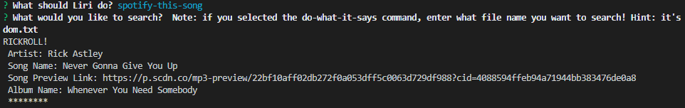
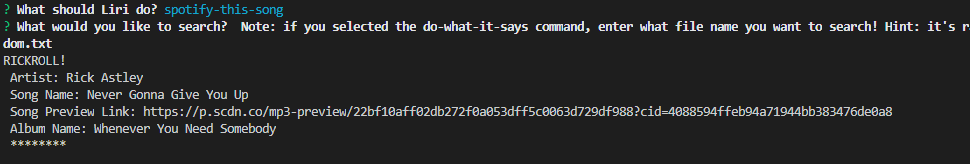

# Liri! 

### Overview

This project creates a program that can accept a finite number of commands, performs different kinds of searches for the commands, and returns relevant data from the searches. The program starts when the user enters "node liri.js" in their terminal. The user will see a list of available commands to choose from, and can then perform a search! Great for random movie trivia and for getting back in touch with your musical side.

Getting Started demo:
https://drive.google.com/open?id=1i3TnTBMSnR3PoghJgVt1cc69TAPGxira

### User Input

In earlier versions of this project, I used process.argv to grab user input. But then we covered the Inquirer package in class, and so I decided to set everything up based on Inquirer. That allowed me to give users a specific choice of commands, thus keeping them from typing something Liri couldn't understand. Once a user selects a command, they are asked to enter a search. I lumped the search in with the initial Inquirer call and command selection because I wanted to avoid having to run Inquirer in each individual command function. The benefits of having it be separate would be that you could have the Inquirer message be command specific, and also that you could choose not to run Inquirer for the one command that is not search-based. I'll dive into that case later in this document.

### Liri Commands

The various Liri commands are programmed as uncalled functions. The commands are organized in a switch statement, so taht when a user selects a command, the appropriate function will be called.

### 1. Concerts

The "concert-this" command takes user input of an artist (ideally an artist who is actively touring) and prints out a list of that artist's upcoming concerts. This information is acquired through the BandsInTown API, which is accessed on Node via the Axios package.

Concert-This demo:
https://drive.google.com/open?id=11DLcUJYu9tpojl5gBxQzjnRPj617XM_2

### 2. Songs

The "spotify-this-song" command takes user input of a song and prints out the top 5 song search results from Spotify. This information is acquired through the Spotify API, which is accessed on Node via the Node-Spotify-API package.

Spotify-This-Song demo
https://drive.google.com/open?id=1h99DPslmGxM6c86V3Gf6ABHR_rm8UZKW 

### 3. Movies

The "movie-this" command takes user input of a movie and prints out the top result from the Online Movie Database. This information is acquired through the OMDB API, which is accessed on Node via the Axios package.

Movie-This demo:
https://drive.google.com/open?id=1jnFUYkc1pxWaAGkdkE3MJ7zb2YHRJ7-2

### 4. Do What It Says

The final command, "do-what-it-says", reads the file called "random.txt" included with this project, and performs the command provided with the search term provided. As the project stands currently, when you select this command, you still have to provide a search term. The Inquirer message instructs the user to enter "random.txt" as the search. As noted earlier in this document, this is perhaps not ideal, since the user wouldn't intuitively know to enter a text file as a search. However, this does allow us to create new files that Liri could read and follow instructions from. Jury's out. As it stands, once you tell Liri to search random.txt, Liri will read the file using the fs package and perform the specified command with the provided search. I won't tell you what those are - that would spoil the surprise! The function for Do What It Says includes cases for all the current Liri commands.

Do-What-It-Says demo:
https://drive.google.com/open?id=1Y--D0qarVptwg6DiB_03_qSfXXSk56_1

### Defaults

What happens if you don't enter a search term? Don't worry, Liri has default searches programmed in! I had fun with these. I'm sure my default theme has been done before...but I found it too entertaining not to use.

Defaults demo:
https://drive.google.com/open?id=1vRHzR5IwHtBLzqrWAHTeVF2V7tiNGOBE

Screenshots for other default cases (spoilers!):

### Liri Log

Any search run in the Liri program gets the results appended to the log.txt file. So if you searched something earlier and want to remember what you found, you can! We use the FS package to append search results to the Liri Log in all of the Liri command functions.

Liri Log demo:
https://drive.google.com/open?id=13F1iutUR4vNXs2zpYgHAmloSZtvEK-Y6

Liri Log live addition demo:
https://drive.google.com/open?id=1zh2u83S9dQoZCOM78SjuM9V_9sZJkhBX 

### Technologies

* Node.js
    * Node-Spotify-API
    * Axios
    * Moment
    * Inquirer
* Spotify API
* BandsInTown API (N.B. my key will expire in January 2020)
* OMDB API

### Potential Improvements

It would be nice not to have to type node liri.js every time you want to perform a new search.

### Author

C'est moi! (Nora Byrd)
